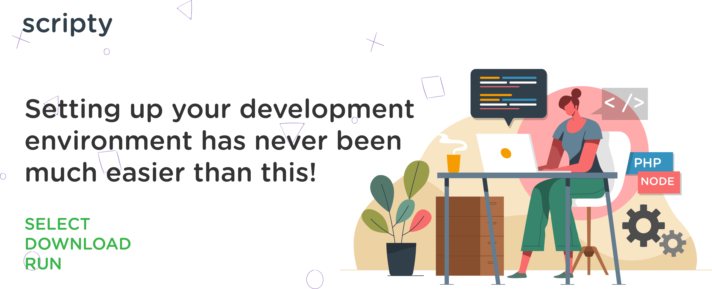

## Web Application for generating a script file based on the user specifications

### BACKEND:

Django REST API Framework is used as a backend which provides REST API endpoints.

>To create a new app

      docker-compose run --rm app sh -c "python manage.py startapp <app_name>"

>To check the Unit Test and Syntax Error

      docker-compose run --rm app sh -c "python manage.py test && flake8

>To apply Migrations

      docker-compose run --rm app sh -c "python manage.py makemigrations

>Spinup the Project:

      docker-compose up

Postgresql is used as Database.

### APPLICATION ENDPOINT

>To retreive List of all the applications

      http://localhost:8000/api/applications

>To retreive particular application

      http://localhost:8000/api/applications/<application_id>

>Post a new application

      http://localhost:8000/api/applications/

      PAYLOAD

      {
            "application_name" : "kubernetes",
            "application_dependency": "docker"
      }
   
>Delete a application

      http://localhost:8000/api/applications/<application_id>
      
 ### In order to use the API view (UI Interface for API Requests)
 Enter the Below url in browser
 
      http://localhost:8000/api/applications
